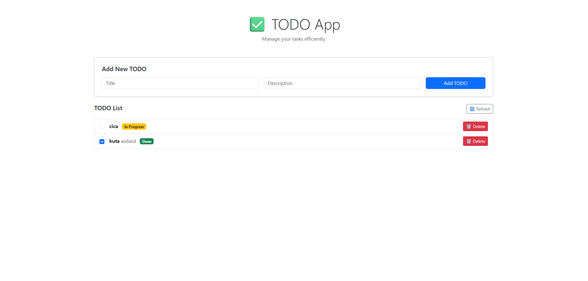

# 📝 TODO App — Full Stack with ClickHouse, Spring Boot & React

This project is a complete TODO app using:
- 🚀 **ClickHouse** for high-performance storage
- ⚙️ **Spring Boot** for the backend API
- 🖼 **React** with Bootstrap for the frontend UI

---




## 📦 1. Setup: ClickHouse with Docker

### 📁 Prerequisites

- Docker + Docker Compose installed
- Port `8123` (HTTP) and `9000` (native) available

### ▶️ Start ClickHouse

```bash
docker-compose up -d
```

### 🔐 Credentials

- Username: `myuser`
- Password: `mypassword`
- Port: `8123` (for HTTP / JDBC)

### 🛠 Initial Setup

The container will:
- Load custom user `myuser`
- Run the SQL script at `initdb/create_table.sql` to create the `todo` table

To reset from scratch:

```bash
docker-compose down -v   # remove volume (data)
docker-compose up -d
```

---

## 🔧 2. Run the Spring Boot Backend

### 📁 Prerequisites

- Java 17+
- Maven installed

### ▶️ Build and Run

```bash
cd backend/
mvn clean spring-boot:run
```

### 📡 API Base URL

```
http://localhost:8080/todos
```

Endpoints:
- `GET /todos` – list active TODOs
- `POST /todos` – create new TODO
- `PUT /todos/{id}` – update TODO
- `DELETE /todos/{id}` – logically delete TODO

### ⚙️ SQL Loader

SQL queries are stored in `/resources/sql/` and loaded using the `SqlLoader` utility.

---

## 🎨 3. Run the React Frontend

### 📁 Prerequisites

- Node.js + npm installed

### ▶️ Start App

```bash
cd frontend/
npm install
npm start
```

### 🔗 URL

```
http://localhost:3000
```

The app will:
- Display TODOs
- Let you create, complete, and delete them
- Automatically refresh the list after actions

---

## ✅ Project Structure

```
.
├── backend/                # Spring Boot app
│   └── src/main/resources/sql/
│       ├── list_active_todos.sql
│       ├── insert_todo.sql
│       ├── update_todo.sql
│       ├── delete_todo.sql
│       └── get_max_version.sql
│
├── frontend/src/              # React app
│   └── App.js
│
├── docker-compose.yml      # ClickHouse + user config + SQL init
├── config/users.xml        # Adds myuser:mypassword
└── initdb/create_table.sql # Creates todo table
```